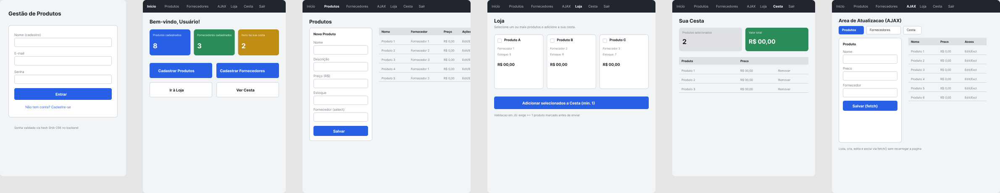
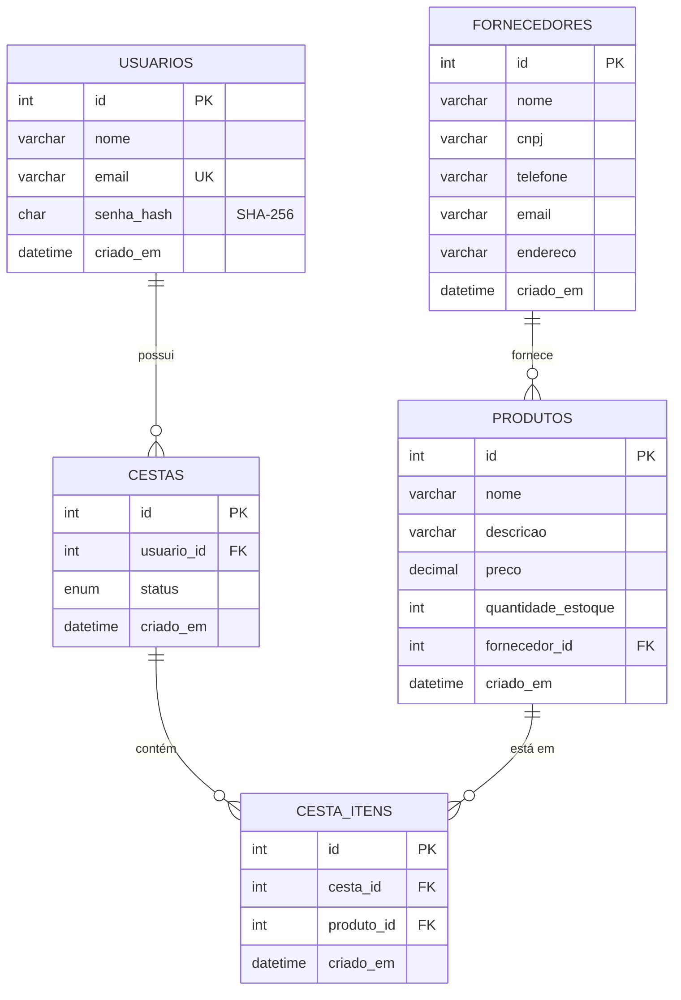

# Mini Sistema de Gestão de Produtos

Trabalho acadêmico que implementa um mini sistema de gestão de produtos utilizando
**Orientação a Objetos**, **relacionamento entre objetos**, **armazenamento em banco
de dados (MySQL/PDO)** e **autenticação de usuários**.

## Autores

| Nome | RA |
|------|----|
| Otavio Silva | 60005860 |

## Funcionalidades

- **Cadastro e login de usuários**, com senha armazenada como hash SHA-256 (nunca em texto puro).
- **Cadastro de Produtos** e **Fornecedores**, com relacionamento N:1 (um produto pertence a um fornecedor).
- **Cesta de compras**, relacionada ao usuário logado (1 cesta aberta por usuário) e aos produtos
  selecionados (relacionamento N:N via tabela `cesta_itens`).
- **Área de CRUD tradicional** (`produtos.php`, `fornecedores.php`) para cadastro dos três elementos no banco.
- **Área de atualização via AJAX** (`gerenciar.php`) que lista, cria, edita e exclui Produtos, Fornecedores
  e itens da Cesta sem recarregar a página (fetch + JSON).
- **Loja** (`loja.php`): lista os produtos com checkbox de seleção; exige ao menos um produto selecionado
  (validação em JavaScript) antes de liberar o botão "Adicionar à Cesta".
- **Cesta** (`cesta.php`): exibe os produtos selecionados, quantidade de itens e valor total (considerando
  uma unidade por produto, conforme o enunciado).
- **Criação automática do banco de dados e das tabelas** na primeira execução (`config/Database.php`),
  não é necessário rodar script SQL manualmente.

## Tecnologias

- PHP 8+ (Orientação a Objetos, sem frameworks como Laravel/Symfony)
- MySQL com PDO (prepared statements)
- HTML5, CSS3, JavaScript (Fetch API / AJAX)
- Bootstrap 5 (via CDN) para os elementos visuais

## Estrutura do projeto

```
SistemaGestaoProdutos/
├── config/
│   └── Database.php        # Conexão PDO + criação automática do banco/tabelas
├── classes/
│   ├── Usuario.php         # Cadastro/login, hash SHA-256
│   ├── Auth.php            # Sessão, login, logout, guarda de rotas
│   ├── Fornecedor.php      # CRUD de fornecedores
│   ├── Produto.php         # CRUD de produtos, relação Produto -> Fornecedor
│   └── Cesta.php           # Cesta do usuário, relação N:N com Produto
├── includes/                # header/navbar/footer reutilizados nas páginas
├── ajax/                    # Endpoints JSON usados pela área de atualização AJAX
│   ├── produtos.php
│   ├── fornecedores.php
│   └── cesta.php
├── assets/
│   ├── css/style.css
│   └── js/{loja.js, gerenciar.js}
├── sql/schema.sql           # Script de referência (opcional, criado automaticamente pela app)
├── index.php                 # Login
├── cadastro.php               # Cadastro de usuário
├── dashboard.php               # Painel inicial
├── produtos.php / fornecedores.php   # CRUD tradicional (área 1)
├── gerenciar.php                       # CRUD via AJAX (área 2)
├── loja.php                              # Seleção de produtos via checkbox (área 3)
└── cesta.php                               # Carrinho / resumo (área 4)
```

## Como executar (XAMPP)

1. Certifique-se de que o **Apache** e o **MySQL** estejam em execução no XAMPP.
2. Coloque (ou acesse via link/junction) esta pasta dentro de `C:\xampp\htdocs`, por exemplo
   `C:\xampp\htdocs\sistema-gestao-produtos`.
3. Acesse `http://localhost/sistema-gestao-produtos/` no navegador.
4. Na primeira requisição, a aplicação cria automaticamente o banco `gestao_produtos` e todas as
   tabelas (usuário padrão do MySQL do XAMPP: `root` sem senha — ajustável em `config/Database.php`).
5. Crie uma conta em **Cadastro**, faça login, cadastre um **Fornecedor**, depois um **Produto** vinculado
   a ele, e explore a **Loja** e a **Cesta**.

## Etapa 1 — Análise (telas)

Wireframes de baixa fidelidade das 6 telas principais do sistema, esboçados no Figma:
**Login/Cadastro, Dashboard, Produtos/Fornecedores (CRUD), Loja (checkbox), Cesta e Área de Atualização (AJAX)**.



Arquivo original no Figma (editável): https://www.figma.com/design/CUWZ1281fV57gmZxkbvoSi

Cada tela reflete o layout realmente implementado no código:

- **Login / Cadastro**: formulário de e-mail/senha e link para cadastro de novo usuário.
- **Dashboard**: menu de navegação, cartões de resumo (produtos, fornecedores, itens na cesta) e atalhos.
- **Produtos / Fornecedores**: formulário de cadastro à esquerda e tabela com Editar/Excluir à direita (CRUD tradicional).
- **Loja**: grade de produtos com checkbox de seleção e botão para adicionar à cesta (validação de ao menos 1 selecionado).
- **Cesta**: cartões de resumo (quantidade e valor total) e tabela dos itens selecionados.
- **Área de Atualização (AJAX)**: abas de Produtos/Fornecedores/Cesta com formulário e tabela atualizados via fetch(), sem recarregar a página.

## Etapa 2 — Modelagem (DER)

Diagrama Entidade-Relacionamento (renderizado automaticamente pelo GitHub via Mermaid):



O script de criação equivalente está em [`sql/schema.sql`](sql/schema.sql) (executado automaticamente pela
aplicação; não precisa ser rodado manualmente).

## Etapa 3 — Implementação

- Backend em **PHP orientado a objetos** (classes `Usuario`, `Auth`, `Fornecedor`, `Produto`, `Cesta`).
- Persistência em **MySQL via PDO** com *prepared statements* em todas as queries.
- Relacionamento entre objetos: `Produto::getFornecedor()` retorna o objeto `Fornecedor` associado;
  `Cesta::getItens()` retorna um array de objetos `Produto` associados à cesta do usuário.
- Front-end com **Bootstrap 5** e **JavaScript (Fetch API)** para a área de atualização AJAX e para a
  validação/envio da seleção de produtos na Loja.
- Banco de dados e tabelas criados automaticamente pela aplicação (`config/Database.php`).

### Boas práticas de commit

Este projeto segue o padrão de mensagens descrito em
[Keep a Changelog](https://keepachangelog.com/pt-BR/1.0.0/), por exemplo:

```
feat: adiciona cadastro de fornecedores
fix: corrige cálculo do total da cesta
docs: atualiza instruções de instalação no README
```

Lembre-se de que **todos os integrantes da equipe devem possuir commits** no histórico do repositório.
